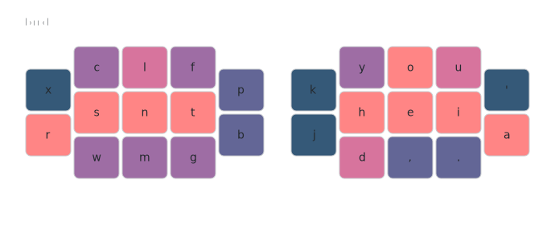
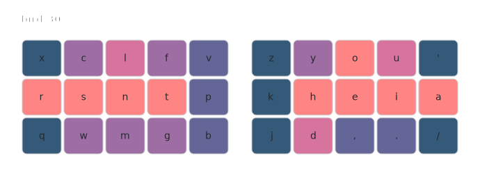
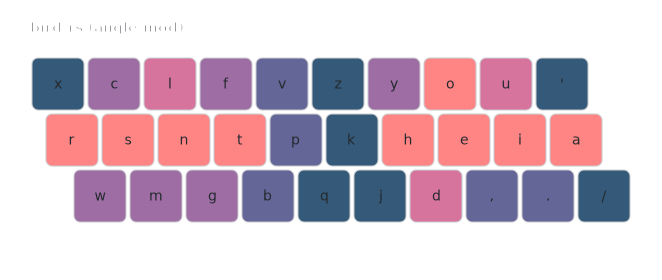

# bird

## Layout

*Generated with [keymap-drawer](https://github.com/caksoylar/keymap-drawer)*



<details>

<summary>text version</summary>

```
x c l f ~   ~ y o u '
r s n t p   k h e i a
~ w m g b   j d , . ~
```

</details>




<details>

<summary>text version</summary>

```
x c l f v   z y o u '
r s n t p   k h e i a
q w m g b   j d , . /
```

</details>



<details>

<summary>text version</summary>

```
x c l f v z y o u '
r s n t p k h e i a
 w m g b q j d , . /
```

</details>

Optimized Punctuation: swap `,` -> `'`

## Design
Goals
- Hummingbird-like physical layouts (variants for other layouts)
- Low same finger bigrams (SFB)
- Low lateral stretch bigrams (LSB)
- Low scissors
- Low redirects
- Low pinky movement
- Low pinky rolls
- Low-er upper index usage
- Upper middle and lower index preferred off home row positions
- Traditional punctuation placement

Outcomes of the above goals
- High alternation
- Low-er one hands
- Top row gravity

## Credits
- [Alan](https://github.com/moutis): The [Hands Down](handsdownlayout.com) family of layouts were a big inspiration. I used a variation of HD Neu for almost 2 years before it evolved into the bird layout.
- [Eve](https://github.com/Apsu): Many of Eve's layouts and experiments were an inspiration and she actively helped with ideas that resulted in this layout.
- [whoa](https://github.com/bredfield): Was the first person outside of myself to try the bird layout and some of his feedback and ideas were incorporated into the layout.
